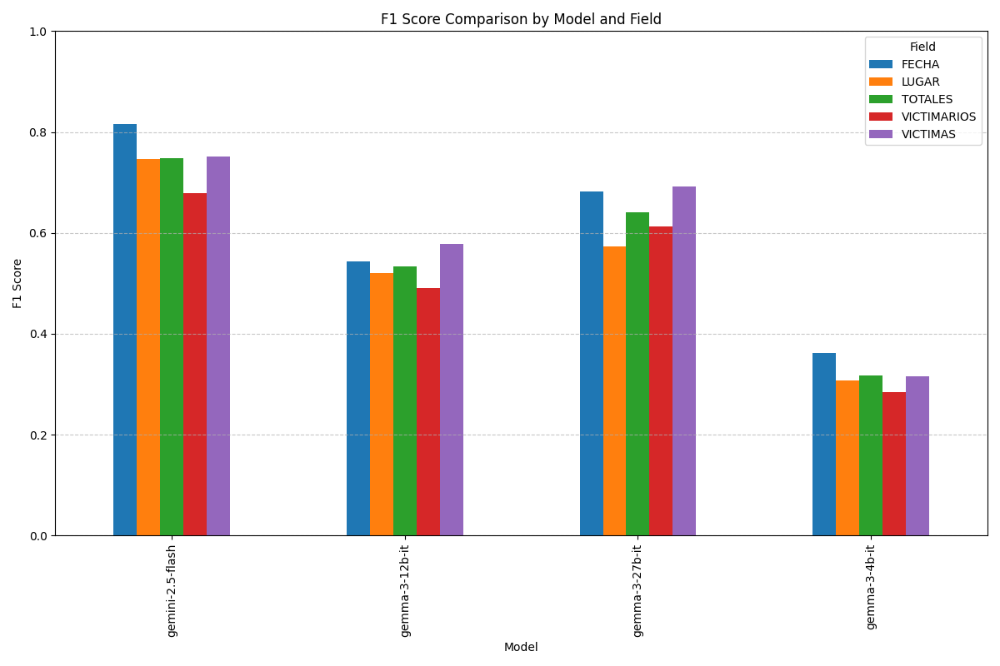
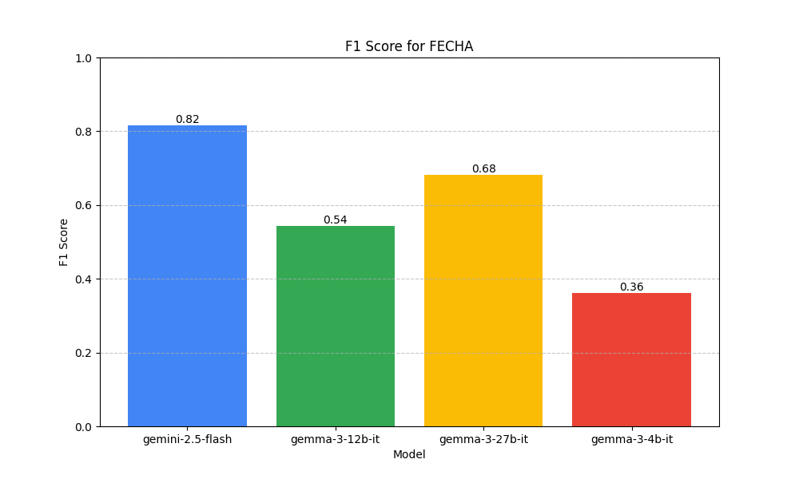
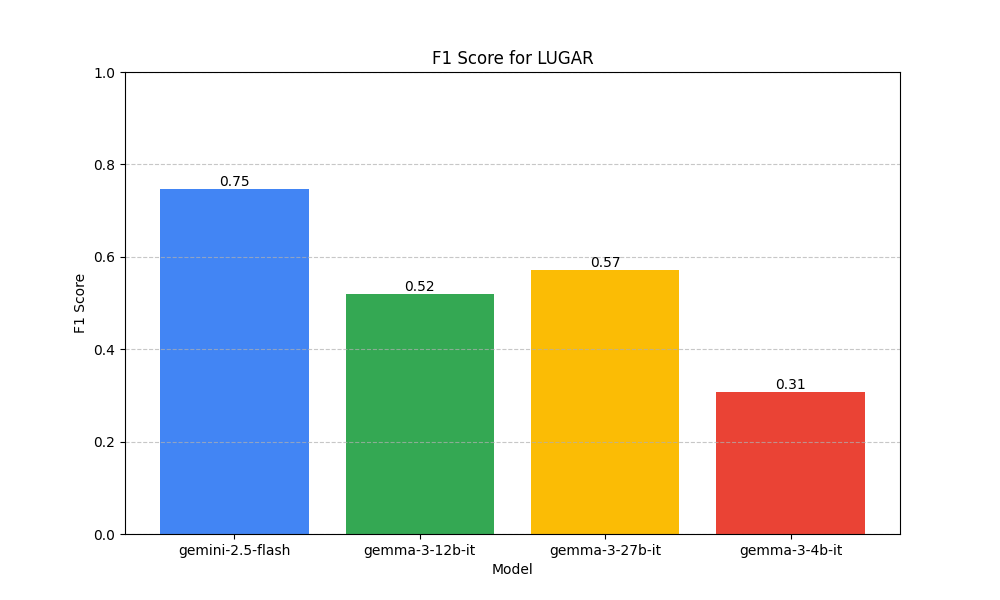
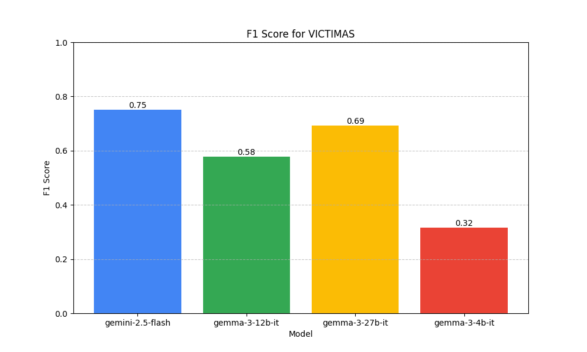
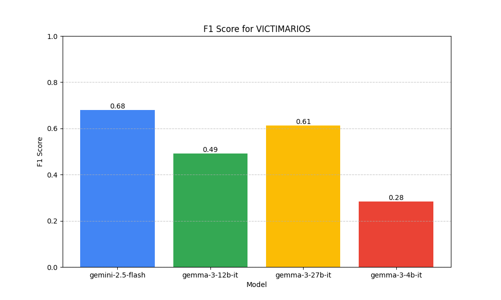

# Event Extractor

Este proyecto utiliza modelos de lenguaje generativo (LLMs) para extraer entidades y eventos estructurados a partir de texto en español.

## Características

- **Extracción de Eventos**: Identifica y estructura eventos complejos y las entidades relacionadas (ej. fechas, lugares, participantes).
- **Soporte para Múltiples Modelos**: Permite intercambiar fácilmente diferentes modelos de la API de Google AI Studio (Gemini, Gemma, etc.) para la extracción.
- **Evaluación de Resultados**: Incluye un script para calcular métricas de rendimiento (precisión, recall, F1-score) comparando los resultados con un conjunto de datos de referencia.
- **Metodología de Evaluación**: Compara cada evento extraído con los de referencia, calculando las métricas (precisión, recall, F1-score) campo por campo. Luego, asigna los pares de eventos de manera óptima para maximizar el F1-score promedio total.

## Cómo Funciona

1.  **Entrada**: El script `extraer.py` lee archivos `.json` de la carpeta `data/`. Cada archivo debe contener un campo `"texto"` con el contenido a procesar.
2.  **Procesamiento**: Utiliza la clase `EventExtractor` que, a su vez, emplea un LLM para analizar el texto y extraer la información según las plantillas definidas en `prompts.py`.
3.  **Salida**: Los resultados de la extracción se guardan en la carpeta `resultados/`, organizados en subcarpetas según el modelo utilizado.
4.  **Evaluación**: El script `evaluar.py` compara los JSON generados con los datos de referencia en `data/` para medir la calidad de la extracción.

## Datos
- Los datos utilizados para este proyecto provienen del proyecto [Angelus de México](https://seguridad.conahcyt.mx/guerra-sucia/angelus). 
- Las anotaciones están basadas en la metodología desarrollada en dicho proyecto. 

## Uso

### 1. Instalación

Clona el repositorio e instala las dependencias:

```bash
git clone <URL-del-repositorio>
cd EventExtractor
pip install -r requirements.txt
```

### 2. Configuración

Crea un archivo llamado `.env` en la raíz del proyecto y añade tu clave de API:

```
API_KEY="TU_API_KEY_AQUI"
```

### 3. Ejecutar la Extracción

Ejecuta el script `extraer.py` especificando el modelo que deseas utilizar. Opcionalmente, puedes indicar los directorios de entrada y salida.

```bash
python extraer.py --modelo <nombre-del-modelo> [--input_dir <ruta>] [--output_dir <ruta>]
```

Ejemplo:
```bash
python extraer.py --modelo gemini-2.5-flash
```

### 4. Evaluar los Resultados

Para evaluar los resultados de un modelo, ejecuta el script `evaluar.py` especificando el modelo. Opcionalmente, puedes indicar los directorios de datos de referencia y de resultados.

```bash
python evaluar.py --modelo <nombre-del-modelo> [--input_dir <ruta>] [--results_dir <ruta>]
```

Ejemplo:
```bash
python evaluar.py --modelo gemini-2.5-flash
```

## Estructura del Proyecto

```
.
├── data/               # Datos de entrada y ground truth (JSON)
├── resultados/         # Resultados de la extracción por modelo
├── .env                # Archivo para la clave de API (ignorado por Git)
├── .gitignore          # Archivos ignorados por Git
├── evaluar.py          # Script para evaluar la calidad de la extracción
├── extractor.py        # Clase principal que se comunica con la API del LLM
├── extraer.py          # Script para ejecutar el proceso de extracción
├── prompts.py          # Plantillas de prompts para el LLM
├── requirements.txt    # Dependencias del proyecto
└── README.md           # Este archivo
```

## Análisis de Rendimiento de Modelos

Se ha realizado una evaluación comparativa de diferentes modelos sobre los datos de referencia utilizando la métrica **F1-Score**.

**Resumen de Resultados:**
- **gemini-2.5-flash** es el modelo con mejor rendimiento general (F1: 0.748).
- **gemma-3-27b-it** muestra un rendimiento intermedio (F1: 0.640).
- **gemma-3-4b-it** presenta el rendimiento más bajo (F1: 0.318).

### Tabla de Métricas Detallada

| Model | Field | Precision | Recall | F1 |
|:---|:---|---:|---:|---:|
| **gemini-2.5-flash** | FECHA | 0.7910 | 0.8413 | **0.8154** |
| | LUGAR | 0.7239 | 0.7698 | 0.7462 |
| | VICTIMARIOS | 0.6622 | 0.6974 | 0.6793 |
| | VICTIMAS | 0.7264 | 0.7778 | 0.7512 |
| | **TOTALES** | **0.7259** | **0.7716** | **0.7480** |
| **gemma-3-27b-it** | FECHA | 0.6744 | 0.6905 | 0.6824 |
| | LUGAR | 0.5659 | 0.5794 | 0.5725 |
| | VICTIMARIOS | 0.6137 | 0.6131 | 0.6134 |
| | VICTIMAS | 0.6680 | 0.7196 | 0.6928 |
| | **TOTALES** | **0.6305** | **0.6506** | **0.6404** |
| **gemma-3-12b-it** | FECHA | 0.5105 | 0.5794 | 0.5428 |
| | LUGAR | 0.4895 | 0.5556 | 0.5204 |
| | VICTIMARIOS | 0.4709 | 0.5114 | 0.4903 |
| | VICTIMAS | 0.5322 | 0.6310 | 0.5774 |
| | **TOTALES** | **0.5008** | **0.5693** | **0.5328** |
| **gemma-3-4b-it** | FECHA | 0.2927 | 0.4762 | 0.3625 |
| | LUGAR | 0.2488 | 0.4048 | 0.3082 |
| | VICTIMARIOS | 0.2338 | 0.3604 | 0.2836 |
| | VICTIMAS | 0.2449 | 0.4458 | 0.3161 |
| | **TOTALES** | **0.2550** | **0.4218** | **0.3179** |

### Gráficos de Rendimiento

#### Comparación General


#### Rendimiento por Campo
<div style="display: flex; flex-wrap: wrap; gap: 10px;">
  
  
  
  
</div>
